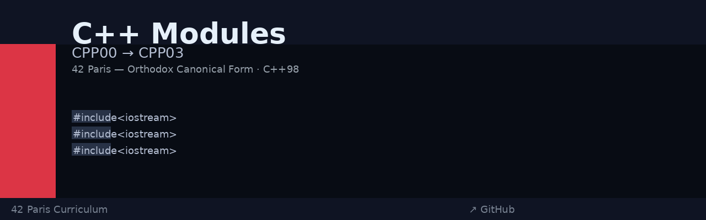

# C++ Modules Learning Path (CPP00 → CPP03)

A comprehensive C++ learning series covering fundamental OOP concepts, memory management, and advanced class design. All modules follow the **Orthodox Canonical Form** and **C++98** standard with `-Wall -Wextra -Werror` compilation flags.

---



---

## 📚 Module Overview

| Module | Focus | Key Concepts |
|--------|-------|--------------|
| **CPP00** | Basics & Classes | Class fundamentals, constructors/destructors, getters/setters |
| **CPP01** | Memory Management | Pointers, references, dynamic allocation, stack vs heap |
| **CPP02** | Operator Overloading | Const correctness, member operators, stream operators |
| **CPP03** | Inheritance | Class hierarchy, virtual inheritance, diamond problem |

---

## 🎯 CPP Module 00 — Namespaces, Classes & Member Functions

**Exercises:** ex00, ex01

### What We Learned

#### Exercise 00: Megaphone
- Simple string manipulation
- Basic C++ syntax and string handling
- Standard output (`std::cout`)

#### Exercise 01: PhoneBook & Contact System
A simple contact management system introducing **classes** and **encapsulation**.

**Key concepts:**
- **Class Definition**: Classes bundle data and functions together
- **Private & Public Members**: Hide implementation details while exposing interfaces
- **Constructors & Destructors**: Initialize and clean up resources
- **Getters & Setters**: Controlled access to member variables via member functions
- **Const Correctness**: Methods that don't modify the object marked as `const`

```cpp
class Contact {
private:
    std::string _firstName;
    std::string _lastName;
    # ...
public:
    Contact();
    void setFirstName(const std::string& name);
    const std::string& getFirstName() const;
};
```

**Key Takeaway:** Classes provide a way to organize data and behavior together, enforcing encapsulation through access control.

---

## 🎯 CPP Module 01 — Memory Allocation, References & Pointers

**Exercises:** ex00–ex05

### What We Learned

#### Exercise 00: Zombie Creation (new/delete)
- **Pointers**: Variables that store memory addresses
- **Dynamic Allocation**: Using `new` to allocate memory on the heap
- **Manual Deallocation**: Using `delete` to free heap memory
- **Stack vs Heap**: Stack objects live until the scope ends; heap objects live until `delete` is called

```cpp
Zombie* newZombie(std::string name) {
    return new Zombie(name);  # Allocated on heap
}
# Caller is responsible for delete
```

#### Exercise 01: Zombie Horde (array allocation)
- **Arrays on the Heap**: Using `new[]` and `delete[]` for multiple objects
- **Common Pitfall**: Using `delete` instead of `delete[]` causes memory leaks

```cpp
Zombie* zombieHorde(int n, std::string name) {
    return new Zombie[n];  # Must use delete[]
}
```

#### Exercise 02: References
- **References**: Non-copyable aliases that must be initialized at declaration
- **Difference from Pointers**: References cannot be null, reassigned, or uninitialized
- **Pass by Reference**: Avoid copying large objects; modify originals directly

```cpp
void setReference(int& ref) {
    ref = 42  # Modifies the original
}
```

#### Exercise 03: Weapon & Humans (reference member)
- **Member References**: A class can have a reference as a member (must initialize in constructor)
- **Lifetime Dependency**: The object holding the reference must not outlive the referenced object
- **Use Cases**: Efficient passing of objects that must be modified and persist

---